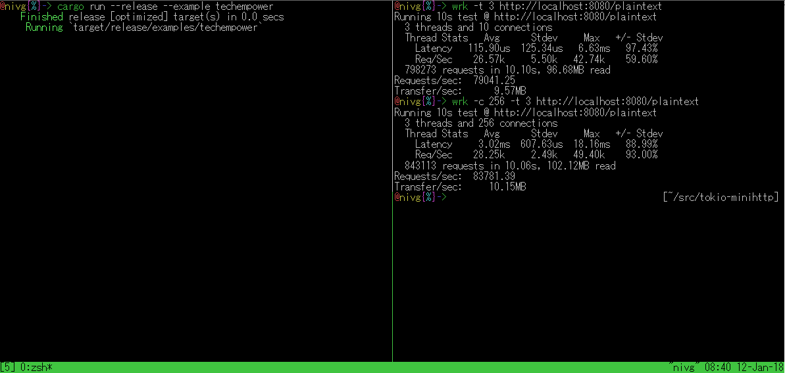
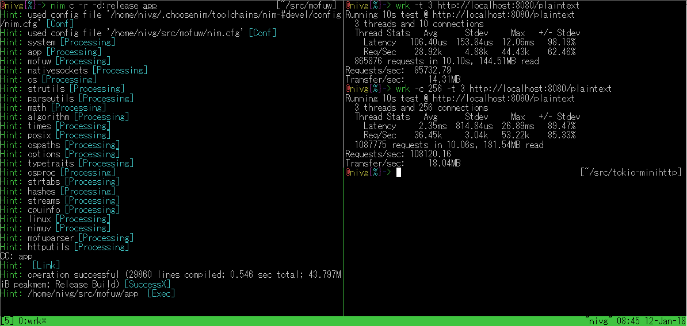

# mofuw 

> mofuw is **M**eccha hayai Asynchronous, Non-Blocking I/**O** no super **F**ast de **U**ltra minimal na **W**eb server on Nim.

> もふぅ ꒰ᐡ - ﻌ - ᐡ꒱ ♡ @2vg

## Feature
- high-performance
- low used memory
- used backend is libuv, so Asynchronous I/O and Non-Blocking I/O
- my parser is implement like [picohttpparser](https://github.com/h2o/picohttpparser), so Zero-Copy, ultra fast parsing... yeah, fast may.
- Easy API, create Web Application, create an extended Web server
- multi-thread support, see app.nim

## Benchmark
see this benchmark result.

mofuw is more faster than [tokio-minihttp](https://github.com/tokio-rs/tokio-minihttp).

#### my server spec:

- OS: Arch Linux 4.13.8-1-ARCH
- CPU: Intel core 2Duo T7700 2.40GHz 3 Core
- MEM: 2GB

### tokio-minihttp

### mofuw

this is a slightly old benchmark result of [techempower](https://www.techempower.com/benchmarks/#section=data-r14&hw=ph&test=plaintext), but if can apply my benchmark result to this techempower's benchmark result, **👑mofuw can aim at 1st place👑**.

Update: this is latest techempower plaintext [result](https://www.techempower.com/benchmarks/previews/round15/#section=data-r15&hw=ph&test=plaintext)

unchanged, **👑mofuw can aim at 1st place👑**.

## example
see [example](https://github.com/2vg/mofuw/blob/master/example)

## Why fast ?
because using libuv, and using fast parser.

about my parser, check [mofuparser](https://github.com/2vg/mofuparser)

~~but, i want to use libev... because more faster than libuv...
this is developping now !~~

if i will made Asynchronous library, i will may replace libuv to libev or Selectors. (or make lib)

## ~~working change backend libuv to libev~~
~~yeah, found way multi-thread event loop so im develop change backend libuv to libev.
but probably, will not to change API usage~~

## Decided to continue developing the back end with libuv
- Why ?

A. because my understanding of asynchrony is not enough yet.

- No plans to change from libuv?

A. answer is **No**.

I will not develop it yet, but it's probably not a distant future.

## Warning
mofuw is now developping.

please be careful when using.

## Require
- nim (tested nim-devel and nim-0.17.2)
- libuv (must installed ver 1.18.0)

## Usage
see [example](https://github.com/2vg/mofuw/blob/master/example)

**Now support GET method only**

## Todo
- [x] ~~header make proc(?)~~
- [ ] Cache (memory buffer ? collab with redis ?)
- [ ] File response (will soon complete)
- [ ] routing (now support GET only, want to finish it early)
- [x] ~~multi-thread (this need ?)~~
